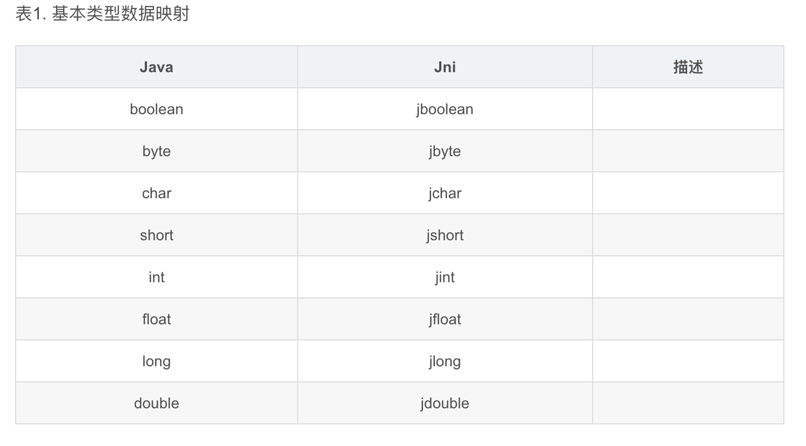
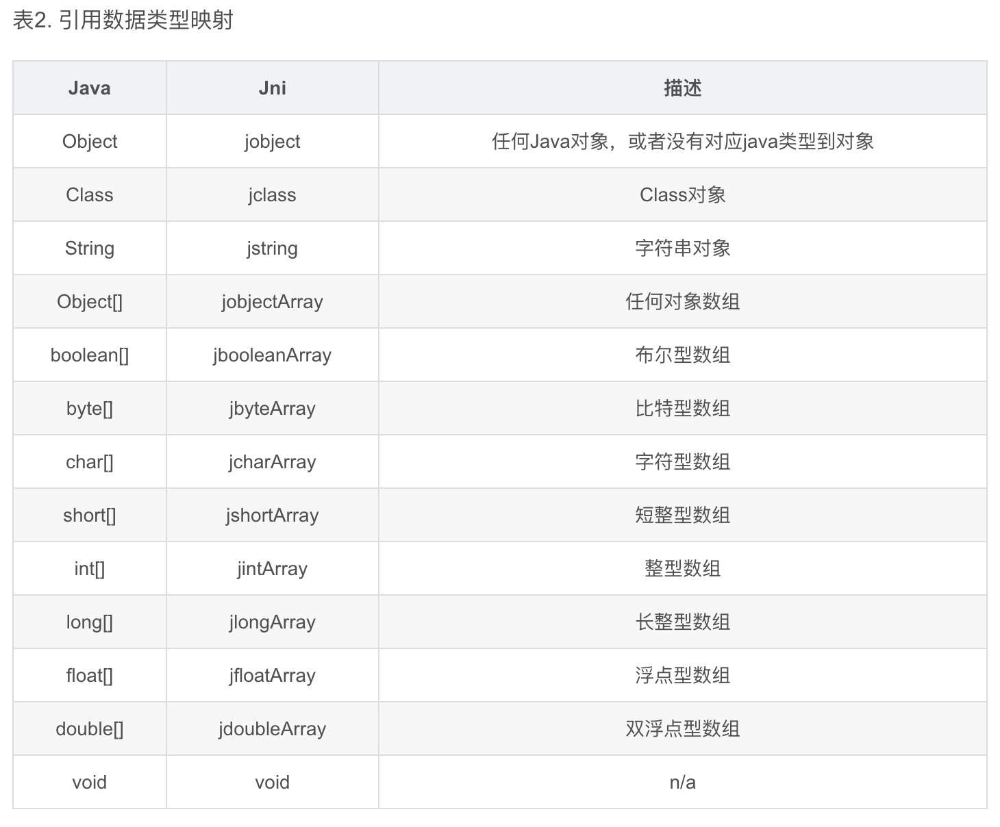

### java 的jni与cpp的变量传输


- java与jni之间的类型映射

  



- 类描述符

  类描述符也叫类签名，签名的作用是准确到描述一件事物，java vm定义了类签名和方法签名。

  在cpp中如果要使用java定义的类，那么就必须得描述出类，相当于声明定义以后才能使用。

  例如string这个类，对应的为java/lang/String

  详细的对照表如下，如果要传输相应的类，则必须进行描述，包括类名和类中的成员变量

  

  

补充一部分常用的域说明：

String类型的域描述符为Ljava/lang/String;

对于数组，其为:[+其类型的域描述符+；

例如：byte[].  -> [B

int[] -> [I

float[]  -> [F

String[] ->[Ljava/lang/String;

Object[] -> [Ljava/lang/Object;

多维数组则是n个[+该类型的域描述符，N代表的是几维数组

int [][]  [] [] 对应的为 [[I


cpp部分的具体实现，见代码

注意：如果要在ubuntu的系统下传输数据，需要两个文件jni.h和jni_md.h


如果要和java传输，java会生成一个相应的头文件com_kitchen_recognition_constant_Recognition.h

cpp端需要写一个com_kitchen_recognition_constant_Recognition.cpp，代表其中的函数实现。具体见相关的文件


其中的部分例子如下：

```c++
//接收java传输的byte[]，给cpp的函数去进行处理
如果要和java传输的函数如下所示：
声明为：传输图像的byte数组
JNIEXPORT jboolean JNICALL Java_com_kitchen_recognition_constant_Recognition_PushFrame
  (JNIEnv *, jobject, jlong, jstring  ,jbyteArray );

函数实现
JNIEXPORT void JNICALL Java_com_kitchen_recognition_constant_Recognition_PushFrame
(JNIEnv *env, jobject obj, jlong cameraID, jstring  frameID,jbyteArray pic){
//其中前两个参数是固定的，一般将参数名都命名为env和obj，可以自由选择
//首先要拿到jni的数组缓存，一般是通过Get***这种形式

int length=env->GetArrayLength();
unsigned char* bytedata=env->GetByteArrayElements(pic,0);

unsigned char* cdata=new unsigned char[length];
memcpy(cdata,bytedata,sizeof(unsigned char)*length);
//此时完成了数据转换，可以传入cpp进行处理

void cppdeal(cdata);
delete cdata;
}


//对应的函数，传输byte数组给java端，函数不接受入参
JNIEXPORT jobject JNICALL Java_com_kitchen_recognition_constant_Recognition_SendFrame
(JNIEnv *env, jobject obj){
//直接传输byte数组，那么需要将图像数据放入jni相关的域中，一般需要使用Set***函数
 int i=0;
 vector<uchar> res=sendFrame(i);//cpp的接口函数，返回一个uchar型的vector数组
 int length=res.size();
 
 
 jbyteArray img=env->NewByteArray(length);
 //将cpp的vector数组转换为unsigned char数组
 
 unsigned char* bytedata=new unsigned char[length];
 memcpy(bytedata,&res[0],sizeof(unsigned char)*length);
 //将uchar*转换为jbye*类型
 
 jbyte* bytes=(jbyte*)bytedata;
 
env->SetByteArrayRegion(img,0,length,bytes);

delete[] bytedata;
return img;
//对应延伸，如果是需要传float数组的话
//vector<float> a;
//jbyteArray res=env->NewFloatArray(a.size());
//env->SetFloatArrayRegion(res,0,a.size(),&a[0]);
 
}


//接收java传过来的结构体，对应的解析相应的结构体
//frame{
//long cameraID;
//string frameID;
//byte[] img;
//}
JNIEXPORT void JNICALL Java_com_kitchen_recognition_constant_Recognition_SendFrame
(JNIEnv *env, jobject obj,jobject frame){

//解析其中的结构体jobject frame，需要知道它的域，这个class的地址是由java端给的
jclass jframe=env->FindClass("Lcom/recognition/bean/Frame;");
jfieldID jcameraID=env->GetFieldID(jframe,"cameraID","J");
jfieldID jframeID=env->GetFieldID(jframe,"frameID","Ljava/lang/String;");
jfieldID jimg=env->GetFieldID(jframe,"img","[B");

//然后解析传过来的frame中的数据
jlong camID=env->GetLongField(frame,jcameraID);
jobject fraID=env->GetObjectField(frame,jframeID);
jobject cimg=env->GetObjectField(frame,img);

//不是很确定
char* frameID2=const_cast(char*)env->GetStringUTFChars(fraID,0);

unsigned char* img2=env->GetByteArrayElements(cimg,0);

//三个参数全部解析完毕，可以送入相关的cpp函数处理


}


//将cpp函数处理的结果，包装成结构体传输给java
/*
Cres{
 jstring frameID;
 jlong cameraID;
 rect[]  crest;
 smallpic[] picarray;
 }
 */
 /*
 smallpic{
   jint index;
   byte[] img;
 }
 rect{
   int x;
   int y;
   int width;
   int height;
 }
 
 
 */
 
 
 
 
 
JNIEXPORT jobject JNICALL Java_com_kitchen_recognition_constant_Recognition_SendObject
(JNIEnv *env, jobject obj){
  //函数不接受入参，直接返回结构，结构体中包含结构体数组
  
  Pic* pic=func();
  vector<Rect> rectimg=pic->rect;
  
  
  //将java中的结构体解析出来
  jclass jrect=env->FindClass(rect,"Lcom/***/rect");
  jfieldID jx=env->GetFieldID(jrect,"x","I");
  jfieldID jy=env->GetFieldID(jrect,"y","I");
  jfieldID jwidth=env->GetFieldID(jrect,"width","I");
  jfiledID jheight=env->GetfieldID(jrect,"height","I");


  jclass jsmallpic=env->FindClass("Lcom/**/smallpic;");
  jfieldID jindex=env->GetFieldID(jsmallpic,"index","I");
  jfieldID jimg=env->GetFieldID(jsmallpic,"img","[B");
  
  
  
  //将结果放到结构体数组中，用rect举例
  jobjectArray rectRes=env->NewObjectArray(rectimg.size(),jrect,NULL);
  for(int i=0;i<rectimg.size();i++){
    jobject rect1=env->NewObject(jrect,env->GetMethodID(jrect, "<init>", "()V"));
    env->SetIntField(rect1,jx,rectimg[i].x);
    env->SetIntField(rect1,jy,rectimg[i].y);
    env->SetIntField(rect1,jwidth,rectimg[i].width);
    env->SetIntField(rect1,jheight,rectimg[i].height);
    
    env->SetObjectArrayElement(rectRes,i,rect1);
  }
  
  //依次类推,将相应的结果放到smallpic数组中
  vector<smallpic*> res=pic->picres;
  jobjectArray smallpicres=env->NewObjectArray(jsmallpic,res.size(),NULL);
  for(int j=0;j<res.size();j++){
  jobject pics=env->NewObject(jsmallpic,env->GetMethodID(jsmallpic,"<init>","()V"));
  //将相应的结果放置到对象中
  env->SetIntField(pics,jindex,res[j]->index);
  
  //图像
  vector<uchar> tmppic=res[j]->img;
  jbyteArray cimg=env->NewByteArray(tmppic.size());//只需要给出长度即可
  
  unsigned char* datas=new unsigned char[tmppic.size()];
  memcpy(datas,&tmppic[0],sizeof(unsigned char)*(res.size()));
  jbyte* img2=(jbyte*)datas;
  
  env->SetByteArrayRegion(cimg,0,res.size(),img2);
  
  delete[] datas;
  env->SetOjectArrayElement(smallpicres,j,pics);
  }
  
  
  //最后的结果返回
  /*
  Cres{
 jstring frameID;
 jlong cameraID;
 rect[]  crest;
 smallpic[] picarray;
 }
*/

jobject jresdetect=env->FindClass(Cres,"Lcom/**/Cres");
jfieldID jframeID=env->GetFieldID(jresdetect,"frameID","Ljava/lang/String;");
jfieldID jcameraID=env->GetFieldID(jresdetect,"cameraID","J");
jfieldID jcrest=env->GetFieldID(jresdetect,"crest","[Ljava/lang/Object;");//传输结构体数组
jfieldID jpicarray=env->GetFieldID(jresdetect,"picarray","[Ljava/lang/Object;");

//将前面处理的结果放到当前的结构体中
jobject detectres=env->NewObject(jresdetect,env->GetMethodID(jresdetect,"<init>","()V"));
//传输一个string变量


jstring s1=env->NewStringUTF(pic->frameID.c_str());

env->SetObjectField(detectres,jframeID,s1);
env->SetLongField(detectres,jcameraID,pic->cameraID);
env->SetObjectField(detectres,jcrest,rectRes);
env->SetObjectField(detectres,jpicarray,smallpicres);


return detectres;

}


```

